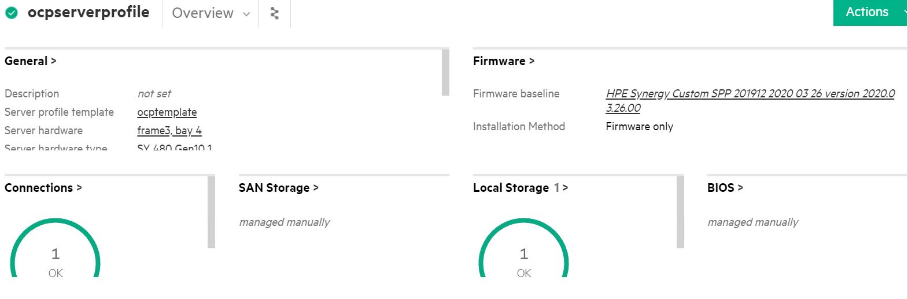

### Role Name: deploy_server_profile

##### Description: 

This role consists of ansible playbooks developed to automate the task of creating and deploying the Server Profiles on the Server Hardware in HPE OneView. It also automates the task of applying the firmware updates, Basic BIOS security settings on the Server Hardware. Lastly it automates the task of validating the firmware updates available on server hardware are matching with firmware details available in the firmware baseline or firmware bundle that is available for server profile via server profile template. These playbooks are meant to be used in conjunction with the deployent guide for ** HPE Container Platform on HPE Synergy**

##### Prerequisites

- Ansible engine with Ansible 2.9.x and Python  3.6.x
- **Python module for HPE OneView**: hpOneView is the Python SDK for the OneView API that allows you to manage OneView functionalities. Download the python repository at https://github.com/HewlettPackard/oneview-python.
- **Ansible module for HPE OneView**: OneView-ansible is the Ansible Module for HPE OneView which utilizes the python SDK to enable infrastructure as a code. Download the repository at https://github.com/HewlettPackard/oneview-ansible/.

##### Software requirements 

| Software    | Version |
| ----------- | ------- |
| HPE OneView | 5       |

##### Input Files

- It is mandatory to update all the inputs files (inputs.yml, hosts, secret.yml, fw_version_inputs.yml) with appropriate values before running any of the playbooks available in this repository.

  - Input file name: hosts

    1. This file is an inventory of host details
    2. Variables from "hosts" that are required by playbooks under "infrastructure" directory are listed here:

    ```
    # [server_profile_template]
    # [server_profile]
    ```

  - Input file name: inputs.yml

    1. Variables from "inputs.yml" that are required by playbooks under "infrastructure" directory are listed here:

    ```
    # enclosure_group: <Enclosure group name as per OneView> 
    # deployment_network_name: <Deployment network name as per OneView>
    # iSCSI_A_network_name: <iscsi_A network name as per OneView>
    # iSCSI_B_network_name: <iscsi_B network name as per OneView>
    # server_profile_template_name: <Custom name for SPT>
    # fw_bundle_path: <Firmware Bundle file path>
    # fw_bundle_file_name: <Firmware file name with extension>
    ```

  - Input file name: secret.yml

    1. This is an ansible vault file.
    2. Variables from "secret.yml" that are required by playbooks under "infrastructure" directory are listed here:

    ```
    # oneview_ip: x.x.x.x 
    # oneview_username: username
    # oneview_password: password
    # oneview_api_version: 1200
    ```

    - Input file name: fw_version_inputs.yml

    1. This file contains the version information of the firmware that should be updated on the server hardware.
    2. Variables from "fw_version_inputs.yml" that are required by playbooks under "infrastructure" directory are listed here:

    ```
    # innovationengine: < INNOVATION_ENGINE_VERSION >
    # systemrombios: < SYSTEM_ROM_VERSION >
    # serverplatformservices: < SERVER_PLATFORM_SERVICES >
    # powermanagementcontroller: < POWER_MANAGEMENT_CONTROLLER >
    # ilo5: < iLO_5_VERSION >
    ```

- Execute following commands on the Ansible Engine to create the required Server Profiles in OneView.

  ```
  # cd $BASE_DIR/infrastructure
  # ansible-playbook -i hosts playbooks/server_profile_fw.yml --ask-vault-pass
  ```

  Note: BASE_DIR is defined in [installer machine](https://hewlettpackard.github.io/hpe-solutions-hpecp/5.2-Synergy/Solution-Deployment/Host-Configuration.html#installer-machine) section in deployment guide

- Expected output on successful creation of Server Profiles and updation of firmware based on firmware baseline specified by the user.

  

- Expected output in OneView on successful creation of Server Profile and updation of firmware based on firmware baseline specified by the user.

  