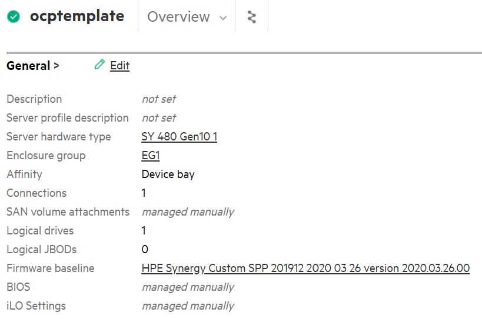

**### Role Name: deploy_master_server_profile_template**


**##### Description:** 


This role consists of ansible playbooks developed to automate the task of creating and deploying the Server Profile Template along with attaching the firmware baseline (firmware bundle for updating the firmwares on HPE Synergy compute module), Basic BIOS Security settings with the profile template in HPE OneView. These playbooks are meant to be used in conjunction with the deployent guide for ***\*HPE Container Platform on HPE Synergy\****

**##### Prerequisites**

\- Ansible engine with Ansible 2.9.x and Python 3.6.x

\- ***\*Python module for HPE OneView\****: hpOneView is the Python SDK for the OneView API that allows you to manage OneView functionalities. Download the python repository at https://github.com/HewlettPackard/oneview-python.

\- ***\*Ansible module for HPE OneView\****: OneView-ansible is the Ansible Module for HPE OneView which utilizes the python SDK to enable infrastructure as a code. Download the repository at https://github.com/HewlettPackard/oneview-ansible/.

**##### Software requirements** 

| Software  | Version |

| ----------- | ------- |

| HPE OneView | 5    |


**##### Input Files**


\- It is mandatory to update all the inputs files (inputs.yml, hosts, secret.yml, fw_version_inputs.yml) with appropriate values before running any of the playbooks available in this repository.


 \- Input file name: hosts


1. This file is an inventory of host details

  2. Variables from "hosts" that are required by playbooks under "infrastructure" directory are listed here:

  ```
 # [server_profile_template]
 # [server_profile]
  ```

 \- Input file name: inputs.yml


1. Variables from "inputs.yml" that are required by playbooks under "infrastructure" directory are listed here:

```
# enclosure_group: <Enclosure group name as per OneView> 

# deployment_network_name: <Deployment network name as per OneView>

# server_profile_template_name: <Custom name for SPT>

# fw_bundle_path: <Firmware Bundle file path>  # Comment this parameter to deploy the server profiles without managing firmware	

# fw_bundle_file_name: <Firmware file name with extension>  # Comment this parameter to deploy the server profiles without managing firmware

# managefw: true  # Change this parameter to false for deploy the server profiles without managing firmware 
```

 \- Input file name: secret.yml


1. This is an ansible vault file.

  2. Variables from "secret.yml" that are required by playbooks under "infrastructure" directory are listed here:

```
# oneview_ip: x.x.x.x 

# oneview_username: username

# oneview_password: password

# oneview_api_version: 1200
```

  \- Input file name: fw_version_inputs.yml


1. This file contains the version information of the firmware that should be updated on the server hardware.

  2. Variables from "fw_version_inputs.yml" that are required by playbooks under "infrastructure" directory are listed here:

```
# innovationengine: < INNOVATION_ENGINE_VERSION >

# systemrombios: < SYSTEM_ROM_VERSION >

# serverplatformservices: < SERVER_PLATFORM_SERVICES >

# powermanagementcontroller: < POWER_MANAGEMENT_CONTROLLER >

# ilo5: < iLO_5_VERSION >
```

**##### Details about the tasks available in this role:** 

The following variable available in the "inputs.yml" file, inform the playbook from about the name of the firmware bundle iso. This iso name is internally converted to a OneView understandable name by OneView APIs. Details about this variable is available in the "inputs.yml" file.


fw_bundle_file_name: <Firmware file name with extension>


This playbook has 2 tasks namely "firmware_driver_details.yml" and "(controller/master/worker)server_profile_template.yml" and server profile template facts file with the name " (controller/master/worker)server_profile_template_file.yml".


Task "firmware_driver_details.yml" checks the availability of the firmware bundle iso specified in the varibale "fw_bundle_file_name" in OneView and derives its name from OneView.


Parameters or facts (OneView Terminology) required to create a Server Profile Template are available in the file "server_profile_template_file.yml". This file gathers the information about various dynamic variables based on the inputs provided by user in the four input files.


Task "server_profile_template.yml" creates the server profile template in OneView.

\- Execute the following commands on the Ansible Engine to create the required Server Profile Templates in OneView.

```
# cd $BASE_DIR/infrastructure

# ansible-playbook -i hosts playbooks/server_profile_template_fw.yml --ask-vault-pass
```

 **NOTE**: BASE_DIR is defined in [installer machine](https://hewlettpackard.github.io/hpe-solutions-hpecp/5.2-Synergy/Solution-Deployment/Host-Configuration.html#installer-machine) section in deployment guide

\- Expected output on successful creation of Server Profile Template using "server_profile_template_fw.yml" playbook.

 

\- In case template is already available then the expected output on successful updation of Server Profile Template with the Server Profile Facts specified in the server_profile_template_file.yml.

 

\- Expected output on successful creation/updation of Server Profile Template in OneView using "server_profile_template_fw.yml" playbook.

 