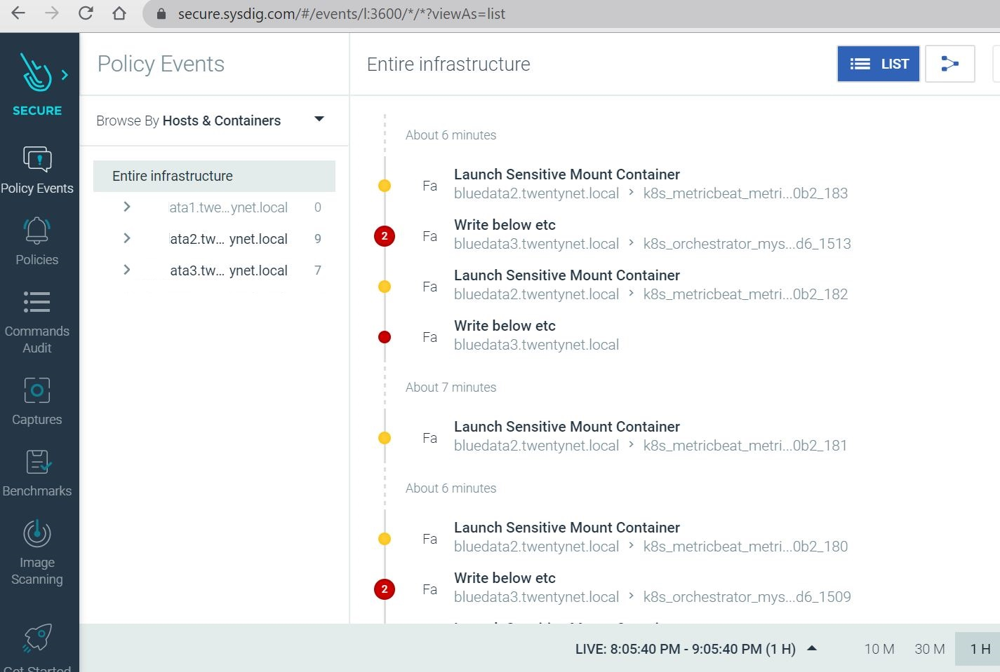
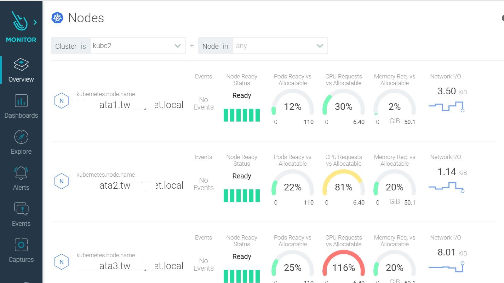

HPE Deployment Guide for integrating Sysdig (sysdig SaaS model for secure and monitor) agents with HPE Container Platform

Prior to using the instructions in this README.md file it is recommended that you read and understand the deployment guide found at https://github.hpe.com/Solutions/HPECP-Synergy/xxx/xx/xx. Instructions found in the deployment guide will take precedence over instructions in README.md files.

________________________________________

## About ##

________________________________________

This repo contains Ansible plays and scripts to automate the installation of sysdig agents onto the HPE Container platform Nodes.

Contents of the repo are:

**playbooks:** This folder contains the playbook required for sysdig agent installation onto the HPECP .

**roles:** This folder contains a role called "sysdig-agent-deploy-hpecp" which is responsible for performing the actions required for sysdig agent integration.

**hosts:** This is the host file which will be used by installer machine to reference hosts during sysdig agent deployment. Provide any installer machine IP or fully qualified domain name of the machine which has access to the container platform cluster and the kubeconfig file access in this file

________________________________________

## Prerequisites ##

________________________________________

 - hpecp is up and running. 

 - User has SaaS based access to Sysdig Secure and Sysdig Monitor for the purpose of Container Security.

 - User has "admin rights and privilege" for Sysdig Secure and Sysdig Monitor.

 - User has valid access token that is given by Sysdig and is specific to their credentials on Sysdig SaaS platform.

 - User has updated the kernel to make sure on all the RHEL nodes have same kernel version. Information regading this can be found by logging into sysdig monitor account. Then go to setting and under Agent Installation you will find instructions to install the kernel headers.

   ```
   yum -y install kernel-devel-$(uname -r)
   ```

   Enable passwordless ssh from Ansible engine to installer machine to itself 

________________________________________

## Custom Attributes\Variable Files and plays ##

________________________________________

**playbooks/sysdig-agent-deployment.yaml**

Each playbook has a role associated with it. Each role has a set of tasks under "task" folder and variables under "var" folder.
These variable values need to be defined by the user according to the installer’s environment before running the plays.

**sysdig-agent-deploy-hpecp/vars/main.yml**

This file will be used during sysdig agent deployment on hpecp and contains sysdig related variables. 

**sysdig-agent-deploy-hpecp/tasks/main.yml**

This file contains the actual sysdig agent installation steps. Edit the variable "k8s_cluster_name" with your HPECP cluster name.

**sysdig-agent-deploy-hpecp/files/sysdig-agent-configmap.yaml**

This file "sysdig-agent-configmap.yaml" is provided by sysdig and handles the sysdig software related configurations.

**sysdig-agent-deploy-hpecp/files/sysdig-agent-daemonset-v2.yaml**

The file "sysdig-agent-daemonset-v2.yamll" is provided by sysdig and handles the sysdig daemon related configurations.

________________________________________

## How to use ##

________________________________________

Step1 : From the Installer Machine command prompt, browse to the BASE_DIR/secuirty/sysdig directory and type update the following files

```
hosts file
playbooks/sysdig-agent-deployment.yaml
roles/sysdig-agent-deploy-hpecp/vars/main.yml
roles/sysdig-agent-deploy-hpecp/files/sysdig-agent-configmap.yaml
```

Step2 : Then run the play using following commands

```
# ansible-playbook -i hosts playbook/sysdig-agent-deployment.yaml
```

Step3: Verification of successful agent deployment. Login to the Installer Machine that is mentioned in the hosts file and type the following command

```
kubectl get all -n sysdig-agent

# kubectl get all -n sysdig-agent
NAME                     READY   STATUS              RESTARTS   AGE
pod/sysdig-agent-9vjt5   0/1     ContainerCreating   0          2s
pod/sysdig-agent-b7rjr   0/1     ContainerCreating   0          2s
pod/sysdig-agent-bcvwx   0/1     ContainerCreating   0          2s
pod/sysdig-agent-fh5w5   0/1     ContainerCreating   0          2s

NAME                          DESIRED   CURRENT   READY   UP-TO-DATE   AVAILABLE   NODE SELECTOR   AGE
daemonset.apps/sysdig-agent   4         4         0       4            0           <none>          2s

Note: If you see a pod on pending state then there might be a possibility that underlying HPECP WORKER node is not functional.
```

Step4: Login to Sysdig Secure and under Policy Events --> Hosts and Containers --> user will find all the node that are part of your HPECP K8s cluster and this shows sysdig agents are successfully installed and monitoring all those nodes.



Step 5: Login to Sysdig Monitor and under Overview --> kubernetes --> nodes user will find all the node that are part of your HPECP K8s 

cluster and this shows sysdig agents are successfully installed and monitoring on all those nodes



```
________________________________________
## Summary ##
________________________________________
These scripts have been tested on HPECP 5, kubernetes version v1.17 and after successful installation of sysdig agent, sysdig secure shows the agents in its web console.

Installer Machine Version: Red Hat Enterprise Linux 7.6

Python: 3.6.9 

Ansible Version: 2.9.4
```